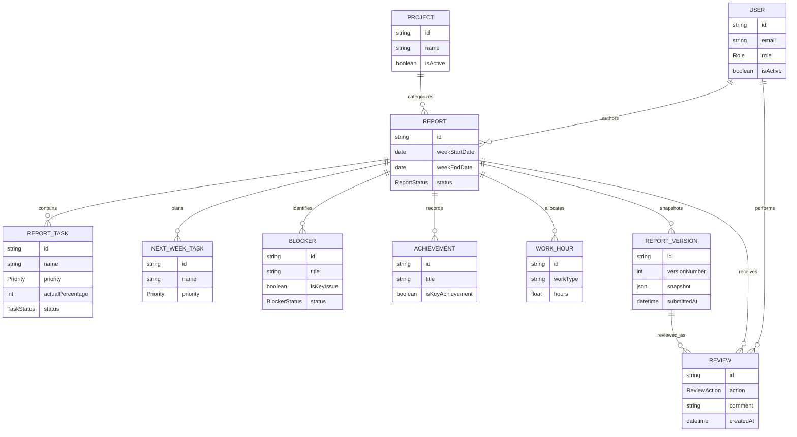

# Entity relationship diagram

```mermaid
erDiagram
 USER ||--o{ REPORT : authors
 USER ||--o{ REVIEW : performs
 PROJECT ||--o{ REPORT : categorizes
 REPORT ||--o{ REPORT_TASK : contains
 REPORT ||--o{ NEXT_WEEK_TASK : plans
 REPORT ||--o{ BLOCKER : identifies
 REPORT ||--o{ ACHIEVEMENT : records
 REPORT ||--o{ WORK_HOUR : allocates
 REPORT ||--o{ REPORT_VERSION : snapshots
 REPORT ||--o{ REVIEW : receives
 REPORT_VERSION ||--o{ REVIEW : reviewed_as
 USER { string id string email Role role boolean isActive }
 PROJECT { string id string name boolean isActive }
 REPORT { string id date weekStartDate date weekEndDate ReportStatus status }
 REPORT_TASK { string id string name Priority priority int actualPercentage TaskStatus status }
 NEXT_WEEK_TASK { string id string name Priority priority }
 BLOCKER { string id string title boolean isKeyIssue BlockerStatus status }
 ACHIEVEMENT { string id string title boolean isKeyAchievement }
 WORK_HOUR { string id string workType float hours }
 REPORT_VERSION { string id int versionNumber json snapshot datetime submittedAt }
 REVIEW { string id ReviewAction action string comment datetime createdAt }
```
