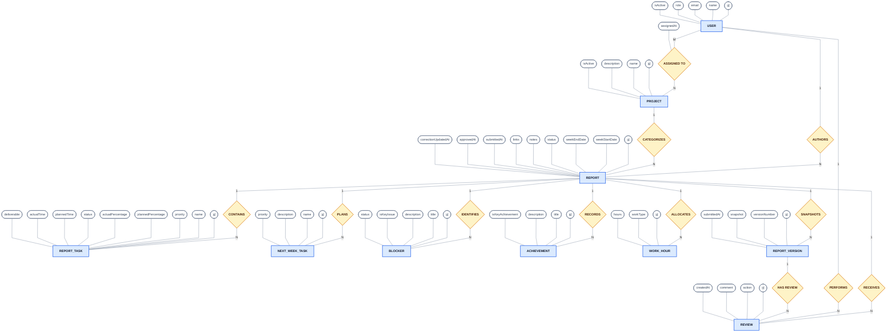

# WeekFlow Entity Relationship Diagram 

```mermaid
%%{init: {"flowchart": {"curve": "linear", "nodeSpacing": 24, "rankSpacing": 52}, "themeVariables": {"fontFamily": "Arial, sans-serif", "fontSize": "15px", "lineColor": "#64748b", "primaryTextColor": "#0f172a"}}}%%
flowchart TB
    USER[USER]
    PROJECT[PROJECT]
    REPORT[REPORT]
    TASK[REPORT_TASK]
    NEXT_TASK[NEXT_WEEK_TASK]
    BLOCKER[BLOCKER]
    ACHIEVEMENT[ACHIEVEMENT]
    WORK_HOUR[WORK_HOUR]
    VERSION[REPORT_VERSION]
    REVIEW[REVIEW]

    AUTHORS{AUTHORS}
    ASSIGNED_TO{ASSIGNED TO}
    CATEGORIZES{CATEGORIZES}
    CONTAINS{CONTAINS}
    PLANS{PLANS}
    IDENTIFIES{IDENTIFIES}
    RECORDS{RECORDS}
    ALLOCATES{ALLOCATES}
    SNAPSHOTS{SNAPSHOTS}
    RECEIVES{RECEIVES}
    PERFORMS{PERFORMS}
    HAS_REVIEW{HAS REVIEW}

    USER ---|1| AUTHORS ---|N| REPORT
    USER ---|M| ASSIGNED_TO ---|N| PROJECT
    PROJECT ---|1| CATEGORIZES ---|N| REPORT
    REPORT ---|1| CONTAINS ---|N| TASK
    REPORT ---|1| PLANS ---|N| NEXT_TASK
    REPORT ---|1| IDENTIFIES ---|N| BLOCKER
    REPORT ---|1| RECORDS ---|N| ACHIEVEMENT
    REPORT ---|1| ALLOCATES ---|N| WORK_HOUR
    REPORT ---|1| SNAPSHOTS ---|N| VERSION
    REPORT ---|1| RECEIVES ---|N| REVIEW
    USER ---|1| PERFORMS ---|N| REVIEW
    VERSION ---|1| HAS_REVIEW ---|N| REVIEW

    ASSIGNED_AT([assignedAt]) --- ASSIGNED_TO

    USER_ID(["<u>id</u>"]) --- USER
    USER_NAME([name]) --- USER
    USER_EMAIL([email]) --- USER
    USER_ROLE([role]) --- USER
    USER_ACTIVE([isActive]) --- USER

    PROJECT_ID(["<u>id</u>"]) --- PROJECT
    PROJECT_NAME([name]) --- PROJECT
    PROJECT_DESCRIPTION([description]) --- PROJECT
    PROJECT_ACTIVE([isActive]) --- PROJECT

    REPORT_ID(["<u>id</u>"]) --- REPORT
    REPORT_WEEK_START([weekStartDate]) --- REPORT
    REPORT_WEEK_END([weekEndDate]) --- REPORT
    REPORT_STATUS([status]) --- REPORT
    REPORT_NOTES([notes]) --- REPORT
    REPORT_LINKS([links]) --- REPORT
    REPORT_SUBMITTED([submittedAt]) --- REPORT
    REPORT_APPROVED([approvedAt]) --- REPORT
    REPORT_CORRECTED([correctionUpdatedAt]) --- REPORT

    TASK_ID(["<u>id</u>"]) --- TASK
    TASK_NAME([name]) --- TASK
    TASK_PRIORITY([priority]) --- TASK
    TASK_PLANNED_PERCENT([plannedPercentage]) --- TASK
    TASK_ACTUAL_PERCENT([actualPercentage]) --- TASK
    TASK_STATUS([status]) --- TASK
    TASK_PLANNED_TIME([plannedTime]) --- TASK
    TASK_ACTUAL_TIME([actualTime]) --- TASK
    TASK_DELIVERABLE([deliverable]) --- TASK

    NEXT_ID(["<u>id</u>"]) --- NEXT_TASK
    NEXT_NAME([name]) --- NEXT_TASK
    NEXT_DESCRIPTION([description]) --- NEXT_TASK
    NEXT_PRIORITY([priority]) --- NEXT_TASK

    BLOCKER_ID(["<u>id</u>"]) --- BLOCKER
    BLOCKER_TITLE([title]) --- BLOCKER
    BLOCKER_DESCRIPTION([description]) --- BLOCKER
    BLOCKER_KEY([isKeyIssue]) --- BLOCKER
    BLOCKER_STATUS([status]) --- BLOCKER

    ACHIEVEMENT_ID(["<u>id</u>"]) --- ACHIEVEMENT
    ACHIEVEMENT_TITLE([title]) --- ACHIEVEMENT
    ACHIEVEMENT_DESCRIPTION([description]) --- ACHIEVEMENT
    ACHIEVEMENT_KEY([isKeyAchievement]) --- ACHIEVEMENT

    WORK_HOUR_ID(["<u>id</u>"]) --- WORK_HOUR
    WORK_HOUR_TYPE([workType]) --- WORK_HOUR
    WORK_HOUR_HOURS([hours]) --- WORK_HOUR

    VERSION_ID(["<u>id</u>"]) --- VERSION
    VERSION_NUMBER([versionNumber]) --- VERSION
    VERSION_SNAPSHOT([snapshot]) --- VERSION
    VERSION_SUBMITTED([submittedAt]) --- VERSION

    REVIEW_ID(["<u>id</u>"]) --- REVIEW
    REVIEW_ACTION([action]) --- REVIEW
    REVIEW_COMMENT([comment]) --- REVIEW
    REVIEW_CREATED([createdAt]) --- REVIEW

    classDef entity fill:#dbeafe,stroke:#2563eb,stroke-width:2px,color:#0f172a,font-weight:bold;
    classDef relationship fill:#fef3c7,stroke:#d97706,stroke-width:2px,color:#451a03,font-weight:bold;
    classDef attribute fill:#ffffff,stroke:#64748b,stroke-width:1.5px,color:#334155;

    class USER,PROJECT,REPORT,TASK,NEXT_TASK,BLOCKER,ACHIEVEMENT,WORK_HOUR,VERSION,REVIEW entity;
    class AUTHORS,ASSIGNED_TO,CATEGORIZES,CONTAINS,PLANS,IDENTIFIES,RECORDS,ALLOCATES,SNAPSHOTS,RECEIVES,PERFORMS,HAS_REVIEW relationship;
    class ASSIGNED_AT,USER_ID,USER_NAME,USER_EMAIL,USER_ROLE,USER_ACTIVE,PROJECT_ID,PROJECT_NAME,PROJECT_DESCRIPTION,PROJECT_ACTIVE,REPORT_ID,REPORT_WEEK_START,REPORT_WEEK_END,REPORT_STATUS,REPORT_NOTES,REPORT_LINKS,REPORT_SUBMITTED,REPORT_APPROVED,REPORT_CORRECTED,TASK_ID,TASK_NAME,TASK_PRIORITY,TASK_PLANNED_PERCENT,TASK_ACTUAL_PERCENT,TASK_STATUS,TASK_PLANNED_TIME,TASK_ACTUAL_TIME,TASK_DELIVERABLE,NEXT_ID,NEXT_NAME,NEXT_DESCRIPTION,NEXT_PRIORITY,BLOCKER_ID,BLOCKER_TITLE,BLOCKER_DESCRIPTION,BLOCKER_KEY,BLOCKER_STATUS,ACHIEVEMENT_ID,ACHIEVEMENT_TITLE,ACHIEVEMENT_DESCRIPTION,ACHIEVEMENT_KEY,WORK_HOUR_ID,WORK_HOUR_TYPE,WORK_HOUR_HOURS,VERSION_ID,VERSION_NUMBER,VERSION_SNAPSHOT,VERSION_SUBMITTED,REVIEW_ID,REVIEW_ACTION,REVIEW_COMMENT,REVIEW_CREATED attribute;
```
